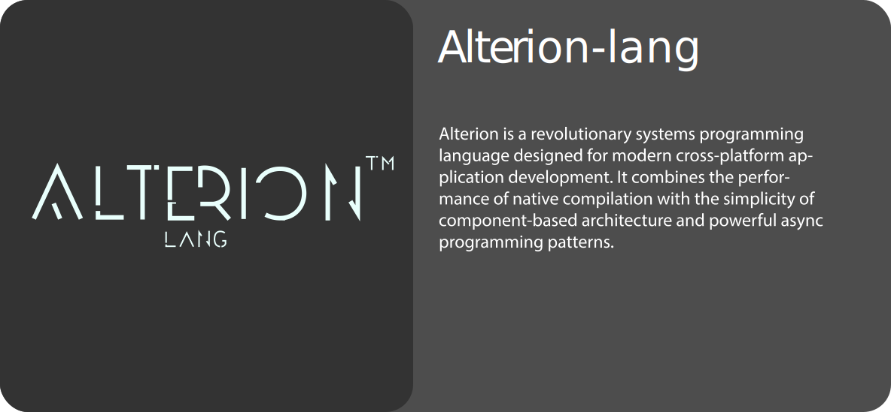

<h1 align="center">👋 Hey there, I'm Chace!</h1>

 
  <em>🔄 Fresh start on GitHub - previous account lost in a data breach</em> 

###

<h4 align="left">💼 Lead Developer @ TechnoSmart247  🌐 Head of Web Development @ Hexagrid IT Solutions 🚀 Freelancer for 1.3 Years 🎨 Full-Stack Developer & Designer</h4>

###

<!-- Artist Credit[:https://masimar00.tumblr.com/post/715578465638842368 ]-->

  

###

  
  
  
  
  
  
  
  
  
  
  
  
  
  
  
  
  

###

  
  
  

  
  

###

<picture>
  <source media="(prefers-color-scheme: dark)" srcset="https://raw.githubusercontent.com/Chace-Berry/Chace-Berry/output/github-contribution-grid-snake-dark.svg">
  <source media="(prefers-color-scheme: light)" srcset="https://raw.githubusercontent.com/Chace-Berry/Chace-Berry/output/github-contribution-grid-snake.svg">
  
</picture>

---

  <h2>📂 Current Projects</h2>
  <a href="https://github.com/Chace-Berry/Alterion-lang" target="_blank">
    <picture>
      <source media="(prefers-color-scheme: dark)" srcset="./assets/card-dark.svg">
      <source media="(prefers-color-scheme: light)" srcset="./assets/card-light.svg">
      
    </picture>
  </a>

###

  

###
